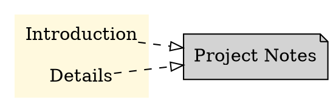

# IWE CLI Commands Documentation

This document provides comprehensive documentation for all IWE CLI commands, including their usage, options, and examples.

## Overview

IWE (IDE for Writing) CLI provides several commands to manage and process markdown-based knowledge management systems. All commands work with IWE workspaces that contain a `.iwe` directory with configuration.

## Global Options

All commands support these global options:

- `-v, --verbose <VERBOSE>`: Set verbosity level (default: 0)
- `-h, --help`: Print help information
- `-V, --version`: Print version information

## Commands

### `init`

Initialize a new IWE workspace in the current directory.

**Usage:**
```bash
iwe init [OPTIONS]
```

**Description:**
Creates a `.iwe` directory with a default `config.toml` file in the current directory. This sets up the workspace for IWE to manage markdown files.

**Options:**
- `-v, --verbose <VERBOSE>`: Set verbosity level (default: 0)

**Examples:**
```bash
# Initialize IWE in current directory
iwe init

# Initialize with verbose output
iwe init --verbose 1
```

**Configuration Created:**
The command creates `.iwe/config.toml` with default settings:
```toml
[library]
path = ""

[markdown]
normalize_headers = true
normalize_lists = true
```

**Behavior:**
- If `.iwe` directory already exists, the command will report that IWE is already initialized
- If a `.iwe` file (not directory) exists, the command will fail
- Creates parent directories if necessary

---

### `normalize`

Normalize and format all markdown files in the workspace according to configuration settings.

**Usage:**
```bash
iwe normalize [OPTIONS]
```

**Description:**
Processes all markdown files in the workspace to apply consistent formatting. This includes normalizing headers, lists, links, and other markdown elements according to the configuration in `.iwe/config.toml`.

**Options:**
- `-v, --verbose <VERBOSE>`: Set verbosity level (default: 0)

**Examples:**
```bash
# Normalize all markdown files
iwe normalize

# Normalize with verbose output
iwe normalize --verbose 1
```

**What it normalizes:**
- Header formatting and spacing
- List item formatting and indentation
- Link formatting and title updates
- Consistent line endings and spacing
- Metadata and frontmatter formatting

**Configuration:**
Behavior is controlled by the `[markdown]` section in `.iwe/config.toml`:
- `normalize_headers`: Whether to normalize header formatting
- `normalize_lists`: Whether to normalize list formatting

---

### `paths`

List all knowledge graph paths up to a specified depth.

**Usage:**
```bash
iwe paths [OPTIONS]
```

**Description:**
Generates a list of paths through the knowledge graph based on the document structure (headers, links, etc.). Each path represents a navigation route through the content hierarchy.

**Options:**
- `-d, --depth <DEPTH>`: Maximum depth to traverse (default: 4)
- `-v, --verbose <VERBOSE>`: Set verbosity level (default: 0)

**Examples:**
```bash
# List paths with default depth (4)
iwe paths

# List paths with depth limit of 2
iwe paths --depth 2

# List all paths regardless of depth
iwe paths --depth 10
```

**Output Format:**
Each line represents a path through the knowledge graph, with path elements separated by " • ":
```
Document Title • Section • Subsection
Another Document • Main Section
```

**Features:**
- Output is sorted and deduplicated
- Paths are based on document structure and links
- Useful for understanding content organization

---

### `squash`

Combine and flatten content for a specific key up to a specified depth.

**Usage:**
```bash
iwe squash [OPTIONS] --key <KEY>
```

**Description:**
Takes content related to a specific key (filename or document identifier) and combines it into a single markdown output, flattening the hierarchy up to the specified depth.

**Required Options:**
- `-k, --key <KEY>`: The key (filename without extension) to squash

**Optional Options:**
- `-d, --depth <DEPTH>`: Maximum depth to include (default: 2)
- `-v, --verbose <VERBOSE>`: Set verbosity level (default: 0)

**Examples:**
```bash
# Squash content for 'project-notes' with default depth
iwe squash --key project-notes

# Squash with specific depth
iwe squash --key meeting-notes --depth 3

# Squash with verbose output
iwe squash --key documentation --depth 1 --verbose 1
```

**Output:**
Produces markdown content that combines all related sections and subsections into a single document. The output maintains markdown formatting but flattens the hierarchical structure.

**Use Cases:**
- Creating comprehensive documents from distributed notes
- Generating reports that combine multiple sources
- Preparing content for export or sharing

---

### `contents`

Generate a table of contents for the workspace.

**Usage:**
```bash
iwe contents [OPTIONS]
```

**Description:**
Generates a markdown table of contents that lists all documents in the workspace with links. Only includes top-level documents (depth 1).

**Options:**
- `-v, --verbose <VERBOSE>`: Set verbosity level (default: 0)

**Examples:**
```bash
# Generate table of contents
iwe contents

# Generate with verbose output
iwe contents --verbose 1
```

**Output Format:**
```markdown
# Contents

[Document Title](document.md)

[Another Document](another.md)

[Project Notes](project-notes.md)
```

**Features:**
- Output is sorted alphabetically
- Includes only unique entries
- Uses document titles from headers when available
- Links point to the actual markdown files

---

### `export`

Export the knowledge graph structure in various formats.

**Usage:**
```bash
iwe export [OPTIONS] <FORMAT>
```

**Description:**
Exports the knowledge graph in different formats for visualization, analysis, or integration with other tools.

**Arguments:**
- `<FORMAT>`: Output format (currently only `dot` is supported)

**Options:**
- `-k, --key <KEY>`: Filter nodes by specific key. If not provided, exports all root notes by default
- `-d, --depth <DEPTH>`: Maximum depth to include (default: 0, meaning no limit)
- `--include-headers`: Include section headers and create subgraphs for detailed visualization. When enabled, shows document structure with sections grouped in colored subgraphs
- `-v, --verbose <VERBOSE>`: Set verbosity level (default: 0)

**Examples:**
```bash
# Export all root documents as DOT format
iwe export dot

# Export specific document by key
iwe export dot --key project-notes

# Export with depth limit
iwe export dot --depth 3

# Export with detailed section visualization
iwe export dot --include-headers

# Export specific key with sections and depth limit
iwe export dot --key meetings --depth 2 --include-headers

# Export with verbose output
iwe export dot --key documentation --verbose 1
```

**DOT Output Modes:**

**Basic Mode (default):**
Produces a DOT format file showing document relationships:


**Detailed Mode (--include-headers):**
Shows document structure with sections grouped in colored subgraphs:


**Key Features:**
- **Colors**: Each document key gets a unique color scheme
- **Shapes**: Documents use `note` shape, sections use `plain` shape
- **Subgraphs**: When using `--include-headers`, sections are grouped in colored clusters
- **Edge Types**: Different edge styles for document-to-document vs section-to-document connections

**Default Behavior:**
- Without `--key`: Exports all root documents in the workspace
- Without `--include-headers`: Shows only documents and their direct relationships
- With `--include-headers`: Includes document sections and creates visual grouping

---

## Configuration

### Workspace Structure

An IWE workspace requires:
```
your-project/
├── .iwe/
│   └── config.toml
├── document1.md
├── document2.md
└── subdirectory/
    └── nested.md
```

### Configuration File

The `.iwe/config.toml` file controls CLI behavior:

```toml
[library]
path = ""  # Relative path to markdown files (empty = current directory)

[markdown]
normalize_headers = true   # Enable header normalization
normalize_lists = true     # Enable list normalization
```

### Library Path

If your markdown files are in a subdirectory, configure the library path:
```toml
[library]
path = "docs"  # Look for markdown files in ./docs/
```

## Error Handling

### Common Issues

1. **Not in IWE workspace**: Most commands require being run in a directory with `.iwe/config.toml`
2. **Missing binary**: Ensure IWE is properly installed and in your PATH
3. **Permission errors**: Ensure write permissions for normalize operations

### Exit Codes

- `0`: Success
- `1`: General error (missing files, invalid arguments, etc.)
- `2`: Command not found or invalid usage

## Examples

### Complete Workflow

```bash
# 1. Initialize a new workspace
mkdir my-knowledge-base
cd my-knowledge-base
iwe init

# 2. Add some markdown files
echo "# Project Overview\n\nThis is my project." > overview.md
echo "# Meeting Notes\n\n## Daily Standup\n\nNotes here." > meetings.md

# 3. Normalize formatting
iwe normalize

# 4. Generate table of contents
iwe contents > README.md

# 5. Explore the knowledge graph
iwe paths --depth 3

# 6. Export for visualization
iwe export dot > graph.dot
dot -Tpng graph.dot -o graph.png

# 7. Combine related content
iwe squash --key meetings --depth 2 > combined-meetings.md
```

### Integration with Other Tools

```bash
# Create SVG visualization using Graphviz
iwe export dot | dot -Tsvg -o output.svg

# Create filtered SVG visualization with depth limit starting from specific key
iwe export dot --key YOUR_KEY --depth 2 | dot -Tsvg -o output.svg

# Create detailed visualization with sections
iwe export dot --include-headers | dot -Tsvg -o detailed-output.svg

# Create PNG visualization
iwe export dot --key project-notes --include-headers | dot -Tpng -o project-graph.png

# Batch processing
for key in $(ls *.md | sed 's/.md//'); do
    iwe squash --key "$key" > "compiled-$key.md"
done
```

## Best Practices

1. **Regular normalization**: Run `iwe normalize` regularly to maintain consistent formatting
2. **Use meaningful filenames**: Filenames become keys for squashing and filtering
3. **Organize with headers**: Use consistent header hierarchies for better paths output
4. **Link between documents**: Create connections for richer knowledge graphs
5. **Version control**: Commit `.iwe/config.toml` but consider your normalization strategy

## Troubleshooting

### Performance

- For large repositories, use `--depth` limits with `paths` and `export`
- Consider excluding large files or directories in your configuration

### Content Issues

- Use `iwe normalize --verbose 1` to debug formatting issues
- Check `.iwe/config.toml` for correct markdown options

### Integration

- IWE works best with consistent markdown styles
- Compatible with most markdown extensions and wiki-style links
