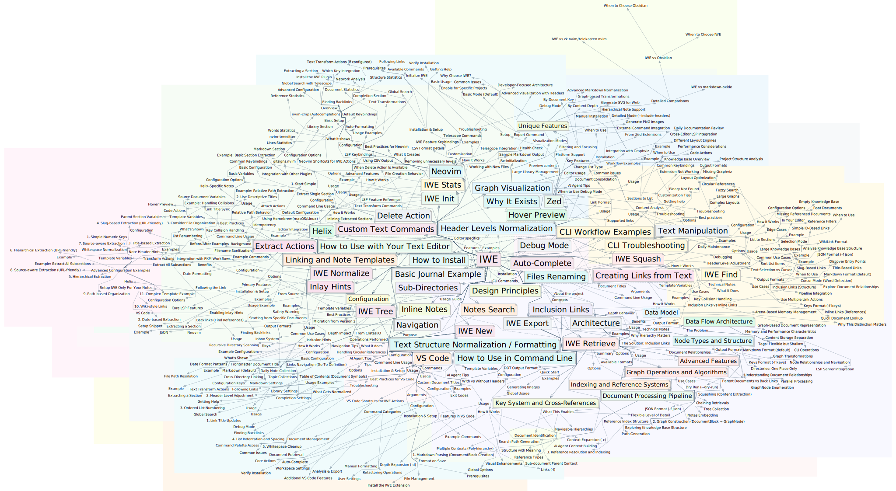

# IWE - Memory system for you and your AI Agents

> Your second brain that AI agents can navigate. A structured knowledge graph for humans and machines.

[](https://crates.io/crates/iwe)
[](https://crates.io/crates/iwe)
[](https://github.com/iwe-org/iwe/blob/master/LICENSE-APACHE)
[](https://github.com/iwe-org/iwe/actions)
[](https://iwe.md)
[](https://github.com/iwe-org/iwe/discussions)



> A messy knowledge base provides messy context to an AI, and messy context yields poor results.

The knowledge you need keeps growing. Codebases expand. Documentation multiplies. Decisions pile up. It's hard to keep it all in your head—or fit it in a context window.

We've all been there: you capture an insight, file it away, and two weeks later it's gone—buried in folders or scattered across apps. When you ask AI for help, you're feeding it fragments hoping something sticks. IWE gives both you and your AI the same map to navigate—one source of truth, shared understanding.

IWE is a knowledge graph that organizes your notes hierarchically and makes them accessible to AI agents. Write in **Markdown**, structure with links, give AI agents the **tools** to navigate your knowledge.

IWE has **no** built-in AI — it's designed to work with external AI tools (like Claude, Codex, Gemini, and others). The CLI provides structured access to your knowledge graph, whether you're scripting your own workflows or giving AI agents the tools and context they need.

## Why IWE?

- **Local-first** — your data stays on your machine as directory with Markdown files
- **Hierarchical knowledge graph** — same note in multiple contexts without duplication using [inclusion links](https://iwe.md/docs/concepts/inclusion-links/)
- **External memory for AI** — [CLI](https://iwe.md/docs/cli/) tools let AI agents retrieve and update your knowledge with full context
- **Editor integration** — search, navigate, refactor notes via LSP ([VS Code](https://iwe.md/docs/editors/vscode/), [Neovim](https://iwe.md/docs/editors/neovim/), [Zed](https://iwe.md/docs/editors/zed/), [Helix](https://iwe.md/docs/editors/helix/))
- **Blazing fast** — Rust-powered, processes thousands of notes instantly

## The Hierarchical Knowledge Graph

IWE organizes your notes as a hierarchical knowledge graph — notes with links and nesting:

- **Hierarchy** — [inclusion links](https://iwe.md/docs/concepts/inclusion-links/) create parent-child relationships, organizing notes into a tree
- **Cross-links** — reference links connect notes across the hierarchy
- **Polyhierarchy** — the same note can appear under multiple parents without duplication
- **Context inheritance** — enrich any note with details from all its parents

This structure makes retrieval powerful: ask for a topic and get its full context—children, parents, and related notes—in a single query.

## Editor Integration (LSP)

IWE integrates with [VS Code](https://iwe.md/docs/editors/vscode/), [Neovim](https://iwe.md/docs/editors/neovim/), [Zed](https://iwe.md/docs/editors/zed/), [Helix](https://iwe.md/docs/editors/helix/), and other editors via the Language Server Protocol (LSP). Get IDE-like features for your markdown: search, auto-complete, go to definition, find references, rename refactoring, and more.

IWE understands document structure—headers, lists, and links—and provides advanced refactorings like extract/inline notes via code actions. It supports standard Markdown, wiki-style links, tables, and other extensions.

- **Search** — find notes by title or content
- **Navigate** — go to definition, find references (backlinks)
- **Preview** — hover over links to see content
- **Auto-complete** — link suggestions as you type
- **Inlay hints** — show parent references and link counts
- **Extract** — pull sections into new notes
- **Inline** — embed note content back into parent
- **Rename** — rename files with automatic link updates
- **Format** — normalize documents, update link titles
- **Transform** — pipe text through external commands
- **Templates** — create notes from templates (daily notes, etc.)
- **Outline conversion** — switch between headers and lists

More information: [LSP Features](https://iwe.md/docs/getting-started/usage/)

## Working with AI (CLI)

IWE provides CLI tools for AI agents to read, navigate, and modify your knowledge graph:

**Read**
- **find** — search documents with fuzzy matching and relationship filters
- **retrieve** — fetch documents with depth and context expansion
- **tree** — display hierarchical structure from any starting point
- **squash** — consolidate multiple documents into a single context

**Write**
- **new** — create documents from templates, accepts content via stdin
- **extract** — extract sections into new documents
- **inline** — embed referenced content back into parent document
- **rename** — rename documents with automatic link updates
- **delete** — remove documents and clean up references

Example: retrieve a topic with 2 levels of children and 1 level of parent context:
```bash
iwe retrieve -k topic -d 2 -c 1
```

Unlike vector databases where agent memory becomes opaque—embeddings you can't read or edit—IWE keeps everything in plain Markdown. No similarity thresholds, no "maybe relevant" results. The agent gets exactly the documents that connect to the topic.

You remain in control. The files are yours, readable and editable. Agents become collaborators that can navigate your knowledge, not black boxes that store it.

More information:
- [Working with AI Documentation](https://iwe.md/docs/agentic/)
- [CLI Reference](https://iwe.md/docs/cli/)

## Quick Start

1. **Install** the CLI and LSP server:

   Using Homebrew (macOS/Linux):
   ```bash
   brew tap iwe-org/iwe
   brew install iwe
   ```

   Or using Cargo:
   ```bash
   cargo install iwe iwes
   ```

2. **Initialize** your workspace:
   ```bash
   cd ~/notes
   iwe init
   ```

3. **Configure** your editor — [VS Code](https://iwe.md/docs/editors/vscode/) · [Neovim](https://iwe.md/docs/editors/neovim/) · [Helix](https://iwe.md/docs/editors/helix/) · [Zed](https://iwe.md/docs/editors/zed/)

4. **Teach** your AI agent — ask it to learn the `iwe` command using its built-in help

## Documentation

- [Getting Started](https://iwe.md/docs/getting-started/installation/) — Installation and setup
- [Usage Guide](https://iwe.md/docs/getting-started/usage/) — Editor features and workflows
- [CLI Reference](https://iwe.md/docs/cli/) — Command-line tools
- [Working with AI](https://iwe.md/docs/agentic/) — AI agent integration
- [Configuration](https://iwe.md/docs/configuration/) — Settings and customization
- [Examples](https://iwe.md/docs/examples/) — Example projects and case studies

## Get Involved

IWE is open source and community-driven. Join the [discussions](https://github.com/iwe-org/iwe/discussions), report [issues](https://github.com/iwe-org/iwe/issues), or contribute to the [documentation](docs/).

**Editor plugins:** [VS Code](https://github.com/iwe-org/vscode-iwe) · [Neovim](https://github.com/iwe-org/iwe.nvim) · [Zed](https://github.com/iwe-org/zed-iwe)

## License

[Apache License 2.0](LICENSE-APACHE)
