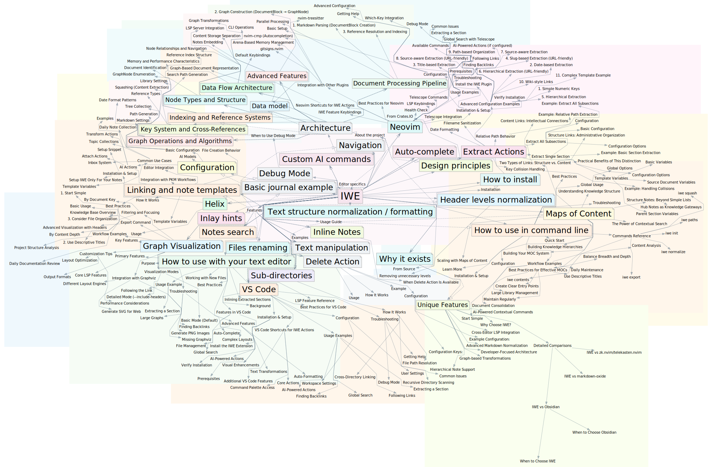
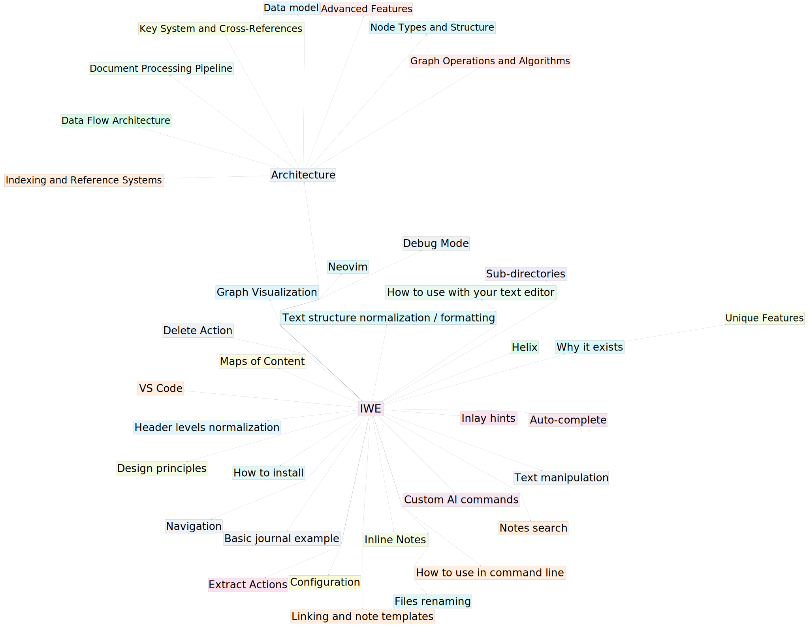

# About IWE

> **Bring IDE-like power to your markdown notes. Fast, local-first PKM for developers.**

[](https://crates.io/crates/iwe)
[](https://crates.io/crates/iwe)
[](https://github.com/iwe-org/iwe/blob/master/LICENSE-APACHE)
[](https://github.com/iwe-org/iwe/actions)
[](https://iwe.md)
[](https://github.com/iwe-org/iwe/discussions)



[IWE](https://iwe.md) is an open-source, local-first, markdown-based note-taking tool. It serves as a personal knowledge management (PKM) solution **designed for developers**.

IWE integrates seamlessly with popular developer text editors such as **VSCode**, **Neovim**, **Zed**, **Helix**, and others. It connects with your editor through the Language Server Protocol (LSP) to assist you in writing and maintaining your Markdown documents.

IWE offers powerful features such as **search**, **auto-complete**, **go to definition**, **find references**, **rename refactoring**, and more. In addition to standard Markdown, it also supports wiki-style links, tables, and other Markdown extensions.

The primary focus of IWE is to be your ultimate writing assistant and keep your notes tidy and structured. It understands the structure of your documents defined by **headers**, **lists**, and **links** and supports advanced refactorings, such as **extract/embed** note and many other via LSP **code actions**.

While IWE supports sub-directories and relative links, it also allows you to organize notes **hierarchically** using Map of Content ([MOC](https://iwe.md/docs/concepts/maps-of-content/)) documents.

> [!NOTE]
>
> The goal of the project is to put powerful knowledge management at your fingertips, making it as seamless as working with code in an IDE for Writing (IWE).

## Why IWE?

- 🚀 **Works in your editor** — VS Code, Neovim, Zed, Helix via LSP
- 🔒 **Local-first** — Your notes stay on your machine, version with Git
- ⚡ **Blazing fast** — Rust-powered, processes thousands of notes instantly
- 🆓 **Free & Open Source** — Apache 2.0 license

## LSP Features

The main LSP features are:

- 🔍 **Search** through your notes
- 🧭 **Navigate** through markdown links
- 👁️ **Preview** linked notes via hover
- 📃 **Templates** for automated notes creation (e.g. daily notes)
- ✨ **Auto-complete** links as you type
- 📥 **Extract** or **inline** sub-notes seamlessly
- 📝 **Format** the document and update link titles automatically
- 🔄 **Rename** files and automatically update all the links
- 🔗 Search for **backlinks** to find references to the current document
- 💡 Display **inlay hints** with parent note references and link counts
- 🤖 Generate or Modify text using **custom** AI commands
- 🔹 Change outline type from headers to list and vice-versa

You can learn more on the [LSP Features](https://iwe.md/docs/getting-started/usage/) page.

Quick Demos:

<details>
<summary>Notes search</summary>


</details>

<details>
<summary>Auto-formatting</summary>


</details>

<details>
<summary>Extract note</summary>


</details>

## CLI Features

IWE also provides a CLI utility that allows you to process thousands of documents in just a second. With IWE, you can reformat documents and update link titles across your entire library. Additionally, you can use the CLI mode to combine multiple files into one comprehensive document and export your note structure as a graph in DOT format for visualization.

The main CLI features are:

- 🏗️ **Initialize** workspace with `init` command
- 🗒️ **Normalize** documents and update link titles automatically
- 📈 **Analyze** knowledge base with comprehensive statistics
- 📊 **Export** note structure as DOT graph for visualization
- 🔍 **List paths** of all markdown files in the workspace
- 📋 **Extract contents** from specific notes and sections
- 🔗 **Squash** multiple files into one comprehensive document
- 🎯 **Filter** exports by key to focus on specific topics

More information is available in:

[CLI Features Documentation](https://iwe.md/docs/cli/)

An example of squash command output converted to [PDF](https://github.com/iwe-org/iwe/blob/master/docs/book.pdf) using [typst](https://github.com/typst/typst) rendering, see `/docs/Makefile` for details.

<details>
<summary>Compact graph visualization example</summary>



</details>

## How to install

You can find the installation instructions in the [Quick Start Guide](https://iwe.md/quick-start).

Check [usage guide](https://iwe.md/docs/getting-started/usage/) for more information.

## Quick Start

1. **Install** the CLI and LSP server:

   Using Homebrew (macOS/Linux):
   ```bash
   brew tap iwe-org/iwe
   brew install iwe
   ```

   Or using Cargo:
   ```bash
   cargo install iwe iwes
   ```

2. **Initialize** your notes workspace:
   ```bash
   cd ~/notes
   iwe init
   ```

3. **Configure** your editor - see guides for [VS Code](https://iwe.md/docs/editors/vscode/), [Neovim](https://iwe.md/docs/editors/neovim/), [Helix](https://iwe.md/docs/editors/helix/), or [Zed](https://iwe.md/docs/editors/zed/)

4. **Start writing** - IWE features are now available in your markdown files

## Documentation

For comprehensive documentation, visit [iwe.md](https://iwe.md/docs/):

- **[Getting Started](https://iwe.md/docs/getting-started/installation/)** - Installation and setup
- **[Usage Guide](https://iwe.md/docs/getting-started/usage/)** - LSP features and how to use them
- **[Configuration](https://iwe.md/docs/configuration/)** - Configuration options and AI setup
- **[CLI Features](https://iwe.md/docs/cli/)** - Command-line interface documentation
- **[Maps of Content](https://iwe.md/docs/concepts/maps-of-content/)** - Hierarchical note organization
- **[Editor Integration](https://iwe.md/docs/editors/)** - Editor-specific guides for [VSCode](https://iwe.md/docs/editors/vscode/), [Neovim](https://iwe.md/docs/editors/neovim/), [Helix](https://iwe.md/docs/editors/helix/), and [Zed](https://iwe.md/docs/editors/zed/)
- **[Debug Mode](https://iwe.md/docs/configuration/debug-mode/)** - Troubleshooting and debugging

## Get Involved

IWE fully depends on community support, which is essential for its growth and development. We encourage you to participate in [discussions](https://github.com/iwe-org/iwe/discussions) and report any [issues](https://github.com/iwe-org/iwe/issues) you encounter.

Contributions to the project [documentation](docs/) are also highly appreciated.

Before contributing, please read our [Contributing Guidelines](CONTRIBUTING.md).

### Plugins / Packages

This repository is for Rust code and crates publishing only. Plugins and packages are in separate repositories. If you are willing to help with a non-listed package type, I'm happy to add a repo for it.

- Neovim plugin is in a separated [repository](https://github.com/iwe-org/iwe.nvim).
- VSCode plugin is [here](https://marketplace.visualstudio.com/items?itemName=IWE.iwe) ([repository](https://github.com/iwe-org/vscode-iwe))
- Zed plugin [repository](https://github.com/iwe-org/zed-iwe)

### Special thanks to

- A heartfelt thank you to [Sergej Podatelew](https://github.com/spodatelev) for his outstanding work on the VSCode plugin.
- Deep appreciation to [Daniel Fichtinger](https://github.com/ficd0) for his contributions to the project documentation and community.
- Many thanks to [Lowband21](https://github.com/Lowband21) for his contributions to the project.

## License

This project is licensed under the [Apache License 2.0](LICENSE-APACHE).

### Inspired by many other open-source projects

- [pandoc](https://pandoc.org)
- [zk notes](https://github.com/zk-org/zk)
- [neuron](https://github.com/srid/neuron)
- [rust-analyzer](https://rust-analyzer.github.io)
