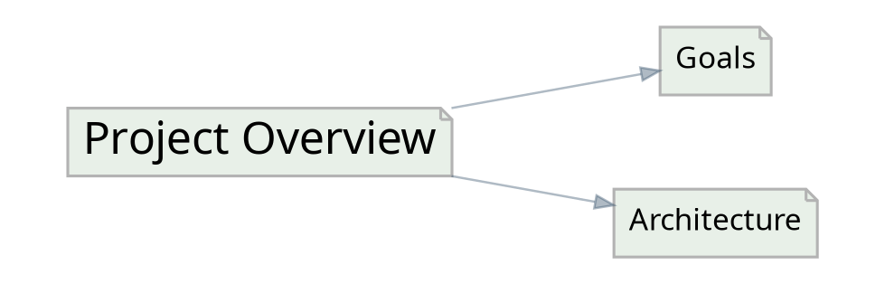

# IWE Export

Exports graph structure in various formats for visualization and analysis.

## Usage

``` bash
iwe export -f <FORMAT> [OPTIONS]
```

## Available Formats

| Format | Description                                 |
| ------ | ------------------------------------------- |
| `dot`  | Graphviz DOT format for graph visualization |


## Options

| Option                  | Default   | Description                                                       |
| ----------------------- | --------- | ----------------------------------------------------------------- |
| `-f, --format <FORMAT>` | `dot`     | Output format                                                     |
| `-k, --key <KEY>`       | all roots | Filter to specific document(s). Repeatable.                       |
| `-d, --depth <DEPTH>`   | `0`       | Maximum depth to include (0 = unlimited)                          |
| `--in <KEY[:DEPTH]>`    | -         | Restrict to sub-documents of EVERY listed key (AND). Repeatable.  |
| `--in-any <KEY...>`     | -         | Restrict to sub-documents of ANY listed key (OR). Repeatable.     |
| `--not-in <KEY...>`     | -         | Exclude sub-documents of any listed key (NOT). Repeatable.        |
| `--max-depth <N>`       | -         | Default depth for `--in` family. Unbounded if omitted.            |
| `--include-headers`     | false     | Include section headers and create detailed subgraphs             |
| `-v, --verbose <LEVEL>` | `0`       | Verbosity level                                                   |

> **Breaking change:** in earlier versions, `iwe export <FORMAT>` accepted the format as a positional argument. The format is now the `-f / --format` flag with a default of `dot`. The previous `iwe export dot` becomes `iwe export -f dot` (or simply `iwe export`).


## DOT Output Format

The DOT format produces Graphviz-compatible output:



Nodes represent documents, edges represent links between them.

## Examples

``` bash
# Export entire graph
iwe export dot

# Export specific document and connections
iwe export dot --key "project-main"

# Include section headers for detailed view
iwe export dot --include-headers

# Export with depth limit
iwe export dot --key "research" --depth 3

# Export with headers and depth limit
iwe export dot --key "research" --depth 3 --include-headers
```

## Generating Images

``` bash
# Generate PNG visualization
iwe export dot > graph.dot
dot -Tpng graph.dot -o graph.png

# Generate SVG for web use
iwe export dot --include-headers > detailed.dot
dot -Tsvg detailed.dot -o detailed.svg

# Direct to PNG (one-liner)
iwe export dot | dot -Tpng -o graph.png

# Interactive visualization in browser
iwe export dot | dot -Tsvg > graph.svg && open graph.svg
```

## Depth Behavior

| Depth | Behavior                                    |
| ----- | ------------------------------------------- |
| `0`   | Unlimited - include all reachable documents |
| `1`   | Only the specified document                 |
| `2`   | Document and its direct links               |
| `3+`  | Document and N-1 levels of connections      |


## With vs Without Headers

| Mode                        | Use Case                                |
| --------------------------- | --------------------------------------- |
| Without `--include-headers` | High-level document relationships       |
| With `--include-headers`    | Detailed view showing internal sections |


## AI Agent Tips

- Use `export dot` to analyze document relationship topology
- Generate visualizations to identify disconnected clusters
- Use `--depth` to focus on specific neighborhoods in large graphs
- Combine with `--key` to visualize a single topic and its context
- The graph structure reveals how knowledge is organized and connected
