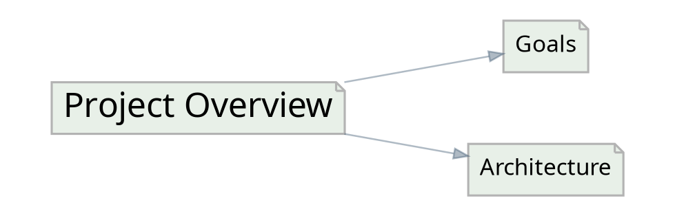

# IWE Export

Exports graph structure in various formats for visualization and analysis.

## Usage

``` bash
iwe export -f <FORMAT> [OPTIONS]
```

## Available Formats

| Format | Description                                 |
| ------ | ------------------------------------------- |
| `dot`  | Graphviz DOT format for graph visualization |


## Options

| Option                          | Default   | Description                                                                          |
| ------------------------------- | --------- | ------------------------------------------------------------------------------------ |
| `-f, --format <FORMAT>`         | `dot`     | Output format. Currently `dot` only.                                                 |
| `-d, --depth <DEPTH>`           | `0`       | Maximum depth to include (0 = unlimited).                                            |
| `--include-headers`             | false     | Include section headers and create detailed subgraphs.                               |
| `--filter <EXPR>`               | -         | Inline YAML filter expression. See [Query Language](query-language.md).              |
| `-k, --key <KEY>`                | all roots | Filter to specific document(s). Repeatable; 1 key = `$eq`, 2+ = `$in`.               |
| `--includes <KEY[:DEPTH]>`      | -         | `$includes` anchor. Repeatable; anchors are ANDed.                                   |
| `--included-by <KEY[:DEPTH]>`   | -         | `$includedBy` anchor. Repeatable; anchors are ANDed.                                 |
| `--references <KEY[:DIST]>`     | -         | `$references` anchor. Repeatable; anchors are ANDed.                                 |
| `--referenced-by <KEY[:DIST]>`  | -         | `$referencedBy` anchor. Repeatable; anchors are ANDed.                               |
| `--max-depth <N>`               | `1`       | Session default for inclusion anchor flags without a colon-suffix. `0` = unbounded.  |
| `--max-distance <N>`            | `1`       | Session default for reference anchor flags without a colon-suffix. `0` = unbounded.  |
| `-v, --verbose <LEVEL>`         | `0`       | Verbosity level.                                                                     |

> **Breaking change:** in earlier versions, `iwe export <FORMAT>` accepted the format as a positional argument. The format is now the `-f / --format` flag with a default of `dot`. The previous `iwe export dot` becomes `iwe export -f dot` (or simply `iwe export`).


## DOT Output Format

The DOT format produces Graphviz-compatible output:



Nodes represent documents, edges represent links between them.

## Examples

``` bash
# Export entire graph
iwe export

# Export specific document and connections
iwe export --key project-main

# Include section headers for detailed view
iwe export --include-headers

# Export with depth limit
iwe export --key research --depth 3

# Export with headers and depth limit
iwe export --key research --depth 3 --include-headers

# Restrict to documents under a hub (unbounded)
iwe export --included-by projects/alpha:0

# Restrict by frontmatter
iwe export --filter 'status: active'
```

## Generating Images

``` bash
# Generate PNG visualization
iwe export > graph.dot
dot -Tpng graph.dot -o graph.png

# Generate SVG for web use
iwe export --include-headers > detailed.dot
dot -Tsvg detailed.dot -o detailed.svg

# Direct to PNG (one-liner)
iwe export | dot -Tpng -o graph.png

# Interactive visualization in browser
iwe export | dot -Tsvg > graph.svg && open graph.svg
```

## Depth Behavior

| Depth | Behavior                                    |
| ----- | ------------------------------------------- |
| `0`   | Unlimited - include all reachable documents |
| `1`   | Only the specified document                 |
| `2`   | Document and its direct links               |
| `3+`  | Document and N-1 levels of connections      |


## With vs Without Headers

| Mode                        | Use Case                                |
| --------------------------- | --------------------------------------- |
| Without `--include-headers` | High-level document relationships       |
| With `--include-headers`    | Detailed view showing internal sections |


## AI Agent Tips

- Use `export` to analyze document relationship topology
- Generate visualizations to identify disconnected clusters
- Use `--depth` to focus on specific neighborhoods in large graphs
- Combine with `--key`, `--included-by`, or `--filter` to visualize a single topic and its context
- The graph structure reveals how knowledge is organized and connected

## Deprecated aliases

The following flags pre-date the query language and remain accepted for backward compatibility. Each invocation prints a one-line `warning: ... is deprecated` to stderr.

| Deprecated         | Use instead                                                                 |
| ------------------ | --------------------------------------------------------------------------- |
| `--in KEY[:N]`     | `--included-by KEY[:N]`                                                     |
| `--in-any K1 K2`   | `--filter '$or: [{ $includedBy: K1 }, { $includedBy: K2 }]'`                |
| `--not-in KEY`     | `--filter '$not: { $includedBy: KEY }'`                                     |
| `--refs-to KEY`    | `--references KEY` (legacy semantics: ORs `$includes` and `$references`)    |
| `--refs-from KEY`  | `--referenced-by KEY` (legacy semantics: ORs `$includedBy` and `$referencedBy`) |
