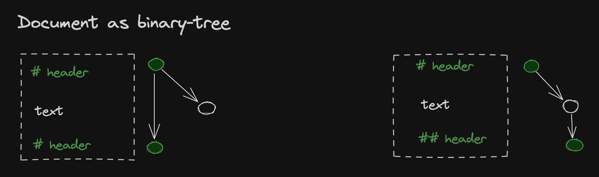

# Data Model

## Graph-Based Document Representation

Unlike traditional parsers that work with document trees, IWE represents text as a **directed graph** where every **header**, **paragraph**, **list**, **list item**, **code block**, **table**, and **reference** becomes a **node**. Each node can have up to two primary relationships:

- **next-element** (the `next` field in code): Points to the sibling node at the same hierarchical level
- **child-element** (the `child` field in code): Points to the first child node (for container elements)

This creates a hybrid tree-graph structure that preserves both document hierarchy and enables complex cross-document relationships.

Structure and text content are stored separately: nodes capture the document hierarchy and relationships, while the text itself lives in a separate content store. This keeps graph operations fast and lets structural changes happen without copying text around.
