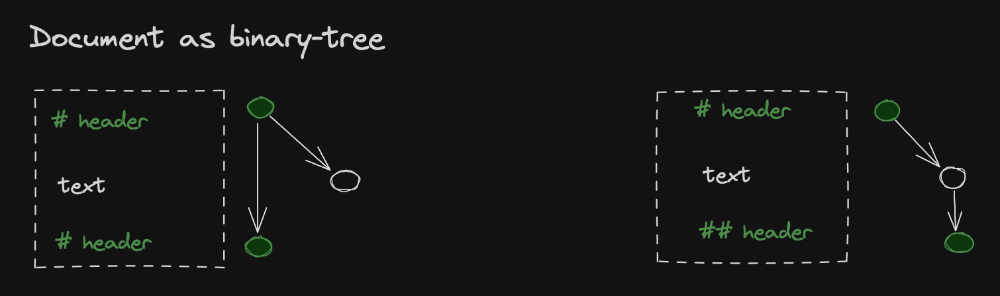

# Data Model

## Graph-Based Document Representation

Unlike traditional parsers that work with document trees, IWE represents text as a **directed graph** where every **header**, **paragraph**, **list**, **list item**, **code block**, **table**, and **reference** becomes a **node**. Each node can have up to two primary relationships:

- **next-element**: Points to the sibling node at the same hierarchical level
- **child-element**: Points to the first child node (for container elements)

This creates a hybrid tree-graph structure that preserves both document hierarchy and enables complex cross-document relationships.



## Arena-Based Memory Management

IWE uses an **arena pattern** for efficient memory management and fast graph operations:

``` rust
#[derive(Clone, Default)]
pub struct Arena {
    nodes: Vec<GraphNode>,      // All graph nodes stored contiguously
    lines: Vec<Line>,           // Text content stored separately
}
```

**Benefits of arena storage:**

- **Fast access**: O(1) node lookup using NodeId as array index
- **Memory efficiency**: Contiguous storage reduces memory fragmentation
- **Cache locality**: Related nodes stored close together in memory
- **Safe deletion**: Empty nodes marked rather than removed
