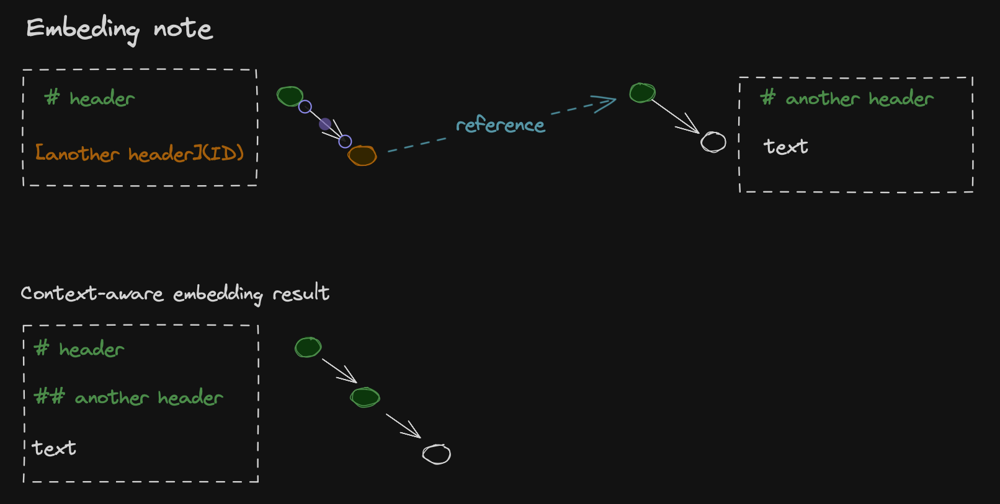

# Advanced Features

## Notes Embedding



IWE can embed referenced documents while preserving structure:

Embedding process:

1.  Identify reference nodes
2.  Load target document graph
3.  Adjust header levels for context
4.  Insert content maintaining hierarchy

**Header level adjustment:**

- Embedded under h2 → all headers +2 levels
- h1 becomes h3, h2 becomes h4, etc.
- Maintains document structure integrity

## Graph Transformations

All document operations are implemented as graph transformations:

- **Normalization**: Graph → normalized graph → markdown
- **Reference resolution**: Update reference targets across graph
- **Content extraction**: Subgraph extraction with proper boundaries
- **Document merging**: Graph composition with conflict resolution

## Parallel Processing

IWE leverages Rayon for parallel operations:

``` rust
// Parallel document processing
let documents: Vec<(Key, Document)> = content
    .par_iter()
    .map(|(k, v)| (Key::name(k), reader.document(v)))
    .collect();

// Parallel search path generation  
let search_paths = self.paths()
    .par_iter()
    .map(|path| generate_search_path(path))
    .collect();
```

This architecture enables IWE to handle large document collections efficiently while maintaining real-time responsiveness for editor integration.
